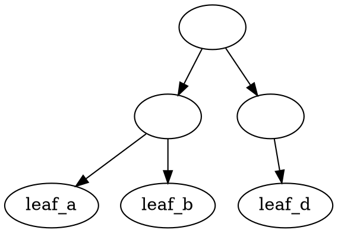

# Tagsystem

## Using this things

    1. Install git, make, and gcc
    2. Clone recurively so the sub-modules are also pulled: `git clone --recursive https://useless.club/git/tavoe/tagsystem.git`
    2. Fix the make file so it works on your platform (or make a new one, or add some new targets)
    3. run `make`
        * The make file should build lmdb and openssl
        * It should delete and re-create the bin folder
        * Builds ts to the bin folder
        * Adds lmdb and openssl .so to the library path
        * Builds/Runs the ts test program in the bin folder
        * Test program creates the database in the bin folder (it will be cleaned up when make is re-run and bin is deleted)
        * *The make file has a bunch of extra targets in it for various auxilary tests I have had to build/run

## Naming
    * Almost everything is prfixed with ts_ (except the iter macro I believe)
    * Most files are named ts....c/h (eg: tsenv.c/h, tstag.c/h)
    * The function/structs in tsenv.c/h are mostly named ts_env_... and often take a first parameter of ts_env
    * The exception to this is ts.c/h, which is the public-facing interface to all the rest of this thing

## Control Flow (or, the code executed when make is called)
    Tagsystem is a library, and not a single program, so there is not one "walk" through the code.
    The most likely entry points are all in ts.c/h, which can be follow through other aspects of the program.

    The code is ts.c is meant to be "context heavy", so typically, you will:
    ```
        ts_cs("tag1 + tag2 + tag3"); // (tag system, change set to tag1, tag2, and tag3)
        ts_mk0(); // make a new document at the intersection of the given sets.
                  // Similar to mkdir, except that you set your directory, then make
        ts_doc_id id;
        ts_mk(id);  // creates another doc with the same tags, but also returns 
                    // the unique id of this document. ts_mk0 stills names the doc, but it discards that id.
                    // The doc be automatically tagged with it's id either way
    ```

    `test/test.c` is a reference app that depends on tagsystem.so. It pretty much just calls some ts.c functions in order.

        
## What stuff is what

* Makefile - build step for the libs, tagsystem, and the test programs. Bit of a mess
bin - directory. Deleted/recreated on every run. Most binary+sample DB end up here. lmdb and openssl don't actually build out to here, but they should probably eventually (?)
lib - git submodules end up here. Don't edit it, it definitally won't be preserved
notes - junk?
src (see the header for the exact functions)
    * ts - top level functions
    * tsenv - tag system environment. Has an lmdb env instance and stores the path to the index and documents.
    * tsdoc - create/delete a document. Also, the functions of working with document IDs and generating a new, unique id.
    * tstag - Tagging and untagging documents. Fairly knarly, but self contained.
    * tsnode - If a tag is a tree of documents, a node is a single item in that tree. Added this later, and probably more logic needs to be consolidated here.
    * tssearch - Looking up docs in the database. Given some tags, yields on document at a time that fulfills those tags.
    * tswalk - A search walk several tag trees. Each individual walk is encapsulated by a walk. So, a search is a collection of walks.
    * tsutil - A few misc utilities.
    * tsiter - Macro for iterating. Wraps a certain common series of function calls. More or less a for-loop with a destructor.

test - test.c is the important one. The other ones are one-offs I used for debugging.. stuff

